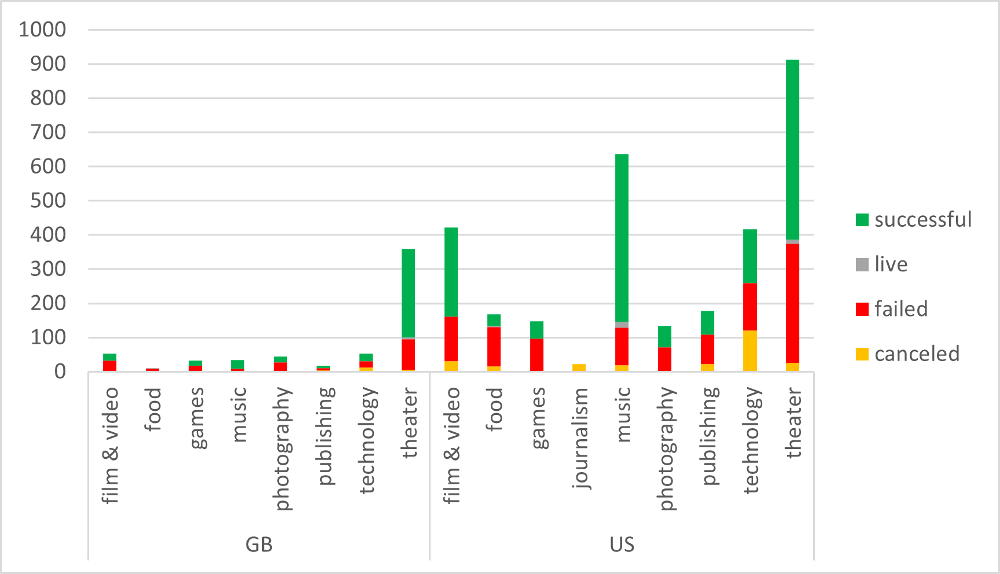

# Kickstarter_challenge
**Overview of Project**
The purpose of the analysis was to determine which campaigns were the most successful in order to reproduce those in the future.    The data can be viewed by country, campaign type, pledged amount, goal amount and dates that the campaign was ran.  

**Analysis and Challenges**
Overall Theatre was the most common campaign and the most successful.  Most campaigns were completed in Great Britain or the US.   The US had almost as many music campaigns as theatre and were just as successful.   
  
There was difficulty in initially dissecting the date due to the large amount of countries, campaign categories, goals and pledge amounts.    Once we were able to find out the success rate and color code them it was a little easier to analyze.   There are so many subcategories that it is harder to find conclusions.   Putting the campaigns into parent categories made it easier to see the top categories.  
**Results**
Two conclusions you can draw about the Theater Outcomes by Launch date are there were more successful outcomes than failed or canceled and most of the successful campaigns were in May and June.    
When looking at the outcomes based on goals the highest success rate was with goals under 25,000.   The goals above 25,000 had a higher cancelled rate as well as failed rate.    The majority of the projects were between 1,000 to 4,999 and had the highest success rate.  
This is a very large set of data with a lot of variables which makes it more difficult to draw overall conclusions.  
We could also create a graph bases on the success rate of different countries and success vs failed rates of the games and photography in comparison with theatre and music.   
